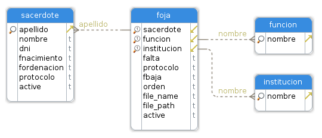
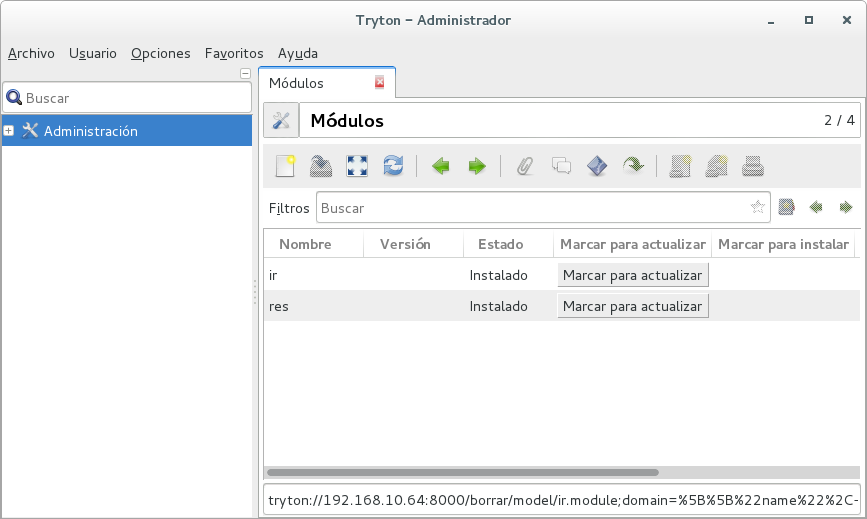

Tryton 4.0 - Módulo paso a paso
===============================

Voy a desarrollar un pequeño módulo y lo iré documentando de la mejor forma posible.

Utilizaré la versión 4.0 del ERP Tryton, y lo haré sin utilizar módulos existentes, lo cual es un error tremendo, pero es solo con la intención de aprender a utilizar el framework.

##Comencemos ...

Este será el diagrama de entidad que utilizaré para desarrollar el módulo:

Como verán, no existe ningún ID como clave primaria, esto no es un error ya que el framework creará los campos necesarios. Por ejemplo, la tabla **funcion** tiene solo un campo, pero al ser tratada por el framework, el resultado será el siguiente:

| campo | descripción |
|-------|-------------|
| **id**          | identificador único (PK)            |
| nombre          | *campo definido en el modelo*       |
| **create_ui**   | id del usuario creador del registro |
| **create_date** | fecha de creación                   |
| **write_ui**    | id del usuario modificador          |
| **write_date**  | fecha de modificación               |

Otro campo que suelo utilizar (también en inglés) es el campo **active** para saber si un registro está activo o no, como una marca de eliminación de registro. Este campo no lo crea el framework pero lo utilizo en inglés para mantener la misma escritura de los módulos propios de Tryton.

No hay que crear ninguna tabla, de esto se encargará el propio framework a medida que vayamos definiendo los modelos.

Una vez instalado nuestro cliente y servidor, podremos ver esta misma pantalla.

Como pueden ver, no existe ningún módulo para instalar.

- - -
[continuar](paso1.md)
