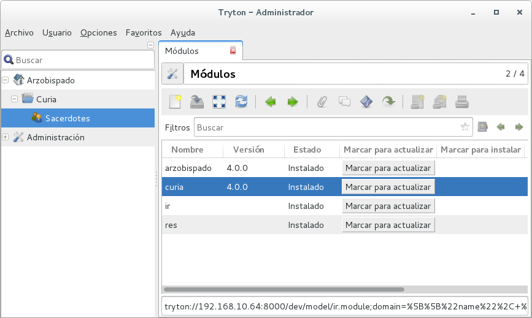

#Paso 1

En este primer paso, crearemos lo mínimo necesario para poder ir avanzando paso a paso.

Lo único que nos interesa ahora es crear la entrada del menú con lo que obtendremos la siguiente pantalla:



Aunque todo se puede desarrollar en un único módulo, yo lo separaré en dos, uno llamado **arzobispado** que será un contenedor para el resto de mis módulos, y **curia** será el módulo que gestionará el diagrama de datos.

Puede descargar el archivo desde [aquí](package/paso1.tar.gz)

Vamos a crear nuestras carpetas y archivos para que tengamos esta estructura:


La carpeta **icons** contendrá los íconos que utilizaremos en cada caso, si no cargamos íconos, siempre podremos utilizar los íconos de Tryton.

Vamos a ir definicendo los archivos uno a uno:

####arzobispado/\_\_init\_\_.py
```python
from trytond.pool import Pool
```

####arzobispado/tryton.cfg
```xml
[tryton]
version=4.0.0
depends:
    ir
    res
xml:
    arzobispado.xml
```

####arzobispado/arzobispado.xml
```xml
<?xml version="1.0"?>
<tryton>
    <data>
        <!-- seguridad -->

        <!-- grupo -->
        <record model="res.group" id="grupo_arzo_admin">
            <field name="name">Arzobispado</field>
        </record>
        <!-- usuario del grupo -->
        <record model="res.user-res.group" id="usuario_admin_grupo_arzo_admin">
            <field name="user" ref="res.user_admin"/>
            <field name="group" ref="grupo_arzo_admin"/>
        </record>
        
        <!-- icono -->
        <record model="ir.ui.icon" id="arzo_icono">
            <field name="name">arzo-icono</field>
            <field name="path">icons/arzo-icono.svg</field>
        </record>

        <!-- creamos la entrada principal del menu -->

        <!-- Menu: raíz principal  -->
        <menuitem name="Arzobispado" id="menu_arzo" sequence="1" icon="arzo-icono"/>

    </data>
</tryton>
```

####curia/\_\_init\_\_.py
```python
from trytond.pool import Pool
```

####curia/tryton.cfg
```xml
[tryton]
version=4.0.0
depends:
    arzobispado
    ir
    res
xml:
    sacerdote.xml
```

En este archivo definimos la dependencia del módulo **arzobispado** ya que ese módulo será el encargado de crear el ítem pricipal del menú

####curia/sacerdote.xml
```xml
<?xml version="1.0"?>
<tryton>
    <data>
        <!-- icono -->
        <record model="ir.ui.icon" id="sacerdote_icono">
            <field name="name">arzo-sacerdote-icono</field>
            <field name="path">icons/arzo-sacerdote-icono.svg</field>
        </record>

        <!-- aquí irá el código que se utilizará para vista y formulario -->

        <!-- menú principal del módulo -->
        <menuitem name="Curia" parent="arzobispado.menu_arzo"
                  id="menu_curia" sequence="1" icon="tryton-open"/>

        <!-- conectamos el item de menu al menu principal -->
        <menuitem name="Sacerdotes" parent="menu_curia"
                  id="menu_sacerdote" sequence="1" icon="arzo-sacerdote-icono" />

    </data>
</tryton>
```

Como puden ver, en este archivo creamos una nueva entrada al menú pero perteneciente a la entrada creada por el módulo **arzobispado** y para poder hacer uso de esta entrada, tendremos que referirnos al modelo * **arzobispado**.menu_arzo*.

- - -
[retroceder](README.md)
[continuar](paso2.md)
