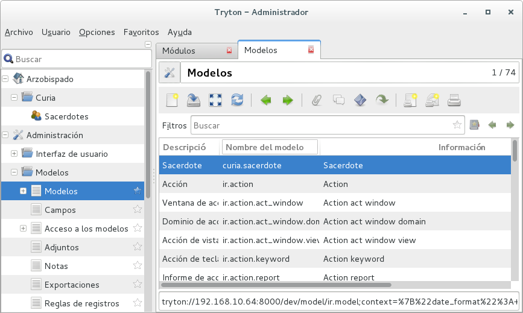

#Paso 2

Ahora crearemos las tablas que vamos a usar, primero modificaremos nuestro archivo **\_\_init\_\_.py** (correspondiente al módulo **curia**) donde definiremos las clases del nuestro módulo.

Podemos decir que nuestro módulo **arzobispado** está completo, por lo que no haremos ninguna modificación. Cada vez que hagamos referencia a un archivo, estaremos hablando del módulo **curia**.

####\_\_init\_\_.py
```python
from trytond.pool import Pool
from .sacerdote import *

def register():
    Pool.register(
        Sacerdote,
        module='curia', type_='model')
```

- - -
Creamos un nuevo archivo:

####sacerdote.py
```python
from trytond.model import ModelView, ModelSQL, fields, Unique

__all__ = ['Sacerdote']

class Sacerdote(ModelSQL, ModelView):
    "Sacerdote"
    __name__ = 'curia.sacerdote'
    _rec_name = 'apellido'

    apellido    = fields.Char('Apellido', required=True)
    nombre      = fields.Char('Nombre', required=True)
    dni         = fields.Char('DNI')
    fnacimiento = fields.Date('Fec. Nacimiento')
    fordenacion = fields.Date('Fec. Ordenacion')
    protocolo   = fields.Char('Protocolo ')
    active      = fields.Boolean('Activo')
```

> \_\_name\_\_ corresponde al nombre interno de la clase
> en Tryton: modulo.clase
> en db    : modulo_clase

- - -
> \_\_rec\_name\_\_ corresponde al campo descriptivo que se utilizará en los select

- - -
Después de actualizar el módulo, obtendremos la siguiente pantalla:



Donde se puede ver que ya fue creada la tabla correspondiente a los sacerdotes.

- - -
[retroceder](paso1.md)
[continuar](paso3.md)
