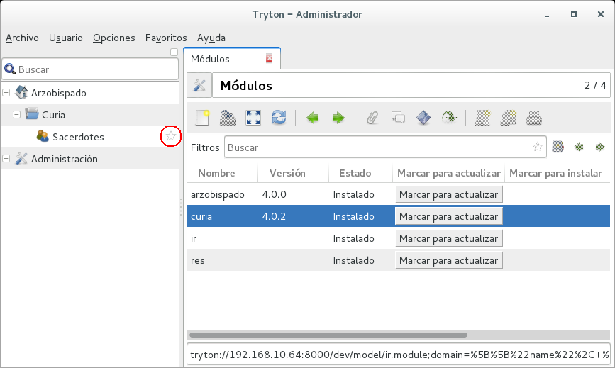
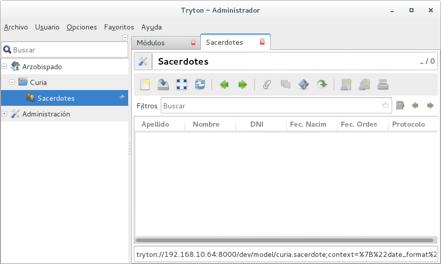
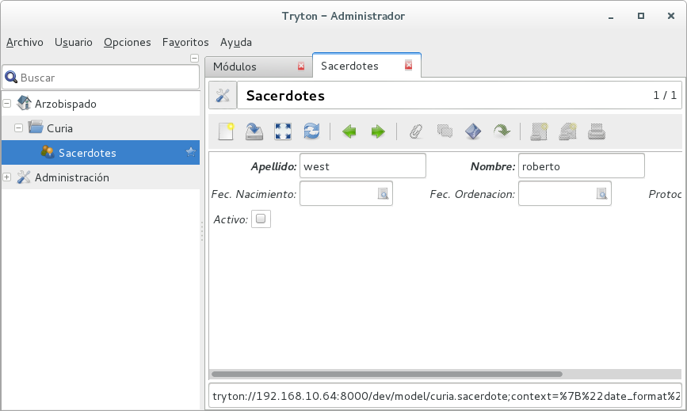

#Paso 3

Ahora nos toca crear nuestras vistas y formularios. También las acciones del menú que se encargarán de ejecutarlas.

Comenzaremos creando una nueva carpeta llamada **view** y dentro de ella dos archivos:

 * sacerdote_form.xml
 * sacerdote_tree.xml

####sacerdote_form.xml
```xml
<?xml version="1.0"?>
<form string="Sacerdote" col="6">
    <label name="apellido"/>
    <field name="apellido"/>
    <label name="nombre"/>
    <field name="nombre"/>
    <label name="dni"/>
    <field name="dni"/>
    <label name="fnacimiento"/>
    <field name="fnacimiento"/>
    <label name="fordenacion"/>
    <field name="fordenacion"/>
    <label name="protocolo"/>
    <field name="protocolo"/>
    <group col="20" colspan="2" id="checkboxes">
        <label name="active"/>
        <field name="active" xexpand="0" width="25"/>
    </group>
</form>
```

####sacerdote_tree.xml
```xml
<?xml version="1.0"?>
<tree string="Sacerdotes">
    <field name="apellido"/>
    <field name="nombre"/>
    <field name="dni"/>
    <field name="fnacimiento"/>
    <field name="fordenacion"/>
    <field name="protocolo"/>
    <field name="active"/>
</tree>
```

Ahora modificaremos el archivo **sacerdote.xml** agregando las acciones del menú.

####sacerdote.xml
```xml
<?xml version="1.0"?>
<tryton>
    <data>
        <!-- icono -->
        <record model="ir.ui.icon" id="sacerdote_icono">
            <field name="name">curia-sacerdote-icono</field>
            <field name="path">icons/curia-sacerdote-icono.svg</field>
        </record>

        <!-- vista -->
        <record model="ir.ui.view" id="sacerdote_view_tree">
            <field name="model">curia.sacerdote</field>
            <field name="type">tree</field>
            <field name="name">sacerdote_tree</field>
        </record>

        <!-- formulario -->
        <record model="ir.ui.view" id="sacerdote_view_form">
            <field name="model">curia.sacerdote</field>
            <field name="type">form</field>
            <field name="name">sacerdote_form</field>
        </record>

        <!-- acción que se ejecutará desde la opción del menú  -->
        <record model="ir.action.act_window" id="act_curia_sacerdote_form">
            <field name="name">Sacerdotes</field>
            <field name="res_model">curia.sacerdote</field>
        </record>

        <!-- acción que conecta la vista -->
        <record model="ir.action.act_window.view" id="act_sacerdote_form_view1">
            <field name="sequence" eval="10"/>
            <field name="view" ref="sacerdote_view_tree"/>
            <field name="act_window" ref="act_curia_sacerdote_form"/>
        </record>

        <!-- acción que conecta el formulario -->
        <record model="ir.action.act_window.view" id="act_sacerdote_form_view2">
            <field name="sequence" eval="20"/>
            <field name="view" ref="sacerdote_view_form"/>
            <field name="act_window" ref="act_curia_sacerdote_form"/>
        </record>

        <!-- menú principal del módulo -->
        <menuitem name="Curia" parent="arzobispado.menu_arzo"
                  id="menu_curia" sequence="1" icon="tryton-open"/>

        <!-- conectamos el item de menu al menu principal -->
        <menuitem parent="menu_curia"
                  id="menu_sacerdote" sequence="1" icon="curia-sacerdote-icono"
                  action="act_curia_sacerdote_form"/>

    </data>
</tryton>
```

- - -
Después de actualizar el módulo, obtendremos la siguiente pantalla:



Como se puede ver en el círculo rojo, ahora tenemos una estrella, esto nos indica que el ítem del menú tiene una acción asociada que la podremos elegir como favorita. No hay que hacerlo, pero así podemos darnos cuenta que nuestra acción ya está asociada.

Al ejecutar la acción **Sacerdotes** se nos abrirá la vista obteniendo esta pantalla:



Y al crear un nuevo registro, esta:



¡PERFECTO! ya tenemos nuestro módulo funcionando  


- - -
[retroceder](paso2.md)
[continuar](paso4.md)
 
