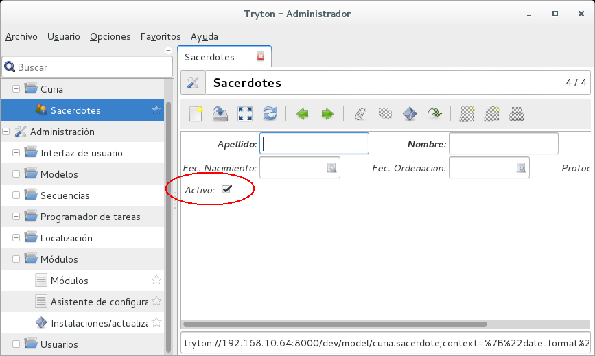

#Paso 4

Aunque todo funciona, ahora comenzaremos a mejorar el funcionamiento del módulo.

 1. Cuando creamos un nuevo registro el valor por defecto del campo **active** es desactivado y no debería ser así ya que los nuevos registros por defecto deberían estar activos.

 2. También me interesa que el apellido del sacerdote esté en mayúsculas y el nombre con mayúscula la primera letra de cada nombre.

 3. El listado de sacerdotes debe estar ordenado por apellido y nombre

Modificamos el siguiente archivo:

####sacerdote.py
```python
from trytond.model import ModelView, ModelSQL, fields, Unique

__all__ = ['Sacerdote']

class Sacerdote(ModelSQL, ModelView):
    "Sacerdote"
    __name__ = 'curia.sacerdote'
    _rec_name = 'apellido'

    apellido    = fields.Char('Apellido', required=True)
    nombre      = fields.Char('Nombre', required=True)
    dni         = fields.Char('DNI')
    fnacimiento = fields.Date('Fec. Nacimiento')
    fordenacion = fields.Date('Fec. Ordenacion')
    protocolo   = fields.Char('Protocolo ')
    active      = fields.Boolean('Activo')

    @classmethod
    def __setup__(cls):
        super(Sacerdote, cls).__setup__()
        cls._order.insert(0, ('apellido', 'ASC'))
        cls._order.insert(0, ('nombre', 'ASC'))

    @classmethod
    def write(cls, *args):
        actions = iter(args)
        args = []

        for sacerdotes, values in zip(actions, actions):
            for key, value in values.iteritems():
                if key == 'apellido':
                    values['apellido'] = values['apellido'].upper()

                if key == 'nombre':
                    values['nombre'] = values['nombre'].title()

            args.extend((sacerdotes, values))

        super(Sacerdote, cls).write(*args)

    @staticmethod
    def default_active():
        return True

```

Después de actualizar, podremos ver que el campo **activo** ahora tiene un valor por defecto.



También haremos un pequeño cambio en la vista para mejorar el comportamiento. Reemplazaremos la siguiente línea de la vista **sacerdote_form.xml**

```python
<form string="Sacerdote" col="6">
```

por esta

```python
<form string="Sacerdote" col="4">
```

Con lo que obtendremos un formulario de dos columnas en vez de tres como la definimos al inicio.


Y por último modificamos el archivo **sacerdote_tree.xml** para que no muestre los registros desactivados.

```python
<field name="active"/>
```

por esta

```python
<field name="active" tree_invisible="1"/>
```

- - - -
[retroceder](paso3.md)
